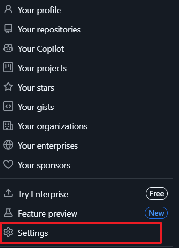
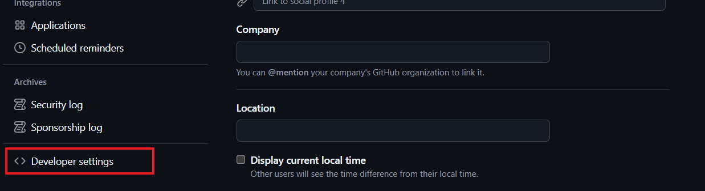
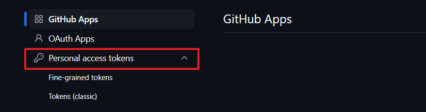
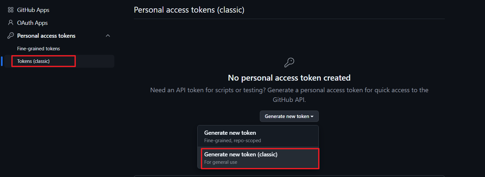
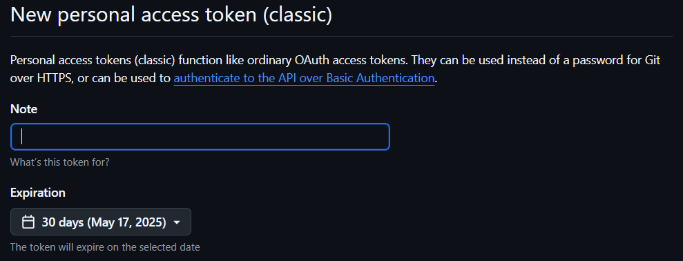

# GITHUB Token 생성 방법
---

# 1. GitHub 설정 페이지 접근
Git 웹사이트에 로그인 이후 우측 상단 프로필 사진을 클릭 이후
드롭다운 메뉴에서 **Settings**을 클릭합니다

# 2. 개발자 설정 메뉴 접근
좌측 사이드 바의 최하단의 **Developer setting**을 클립합니다

# 3. Personal access token 메뉴
**Personal access token** 클릭하면 두개의 토큰 생성 옵션이 존재하는 것을 볼 수 있습니다

설명을 참고하여 3-1, 3-2 중 하나를 선택하여 토큰을 생성하시면 됩니다

- Fine-grained token : classic 토큰에 비해 보안성이 높습니다
- classic token : 넓은 범위의 읽기 및 쓰기 범위에서 권한 부여합니다

참고 : https://docs.github.com/ko/authentication/keeping-your-account-and-data-secure/managing-your-personal-access-tokens

## 3-1. Fine-grained token
**Generate new token**을 통해 token을 생성합니다

## 3-2. classic token
**Generate new token**을 통해 token을 생성합니다

# 4. note, Expiration 설정
- Note : 토큰 이름
- Expiration : 토큰 유효 기간

- 3-2(classic token 생성)방식을 선택한 경우 해당 프로젝트를 진행하기 위해 필요한 권한은 없으므로 옵션을 선택하지 않아도 됩니다

# 5. token 생성 완료
토큰 값은 저장하시고 복사하시면 됩니다

# 주의 
CodeSpace환경에서 Token값 저장시, PR 과정에서 Token값도 PR되지 않게 주의하시길 바랍니다
